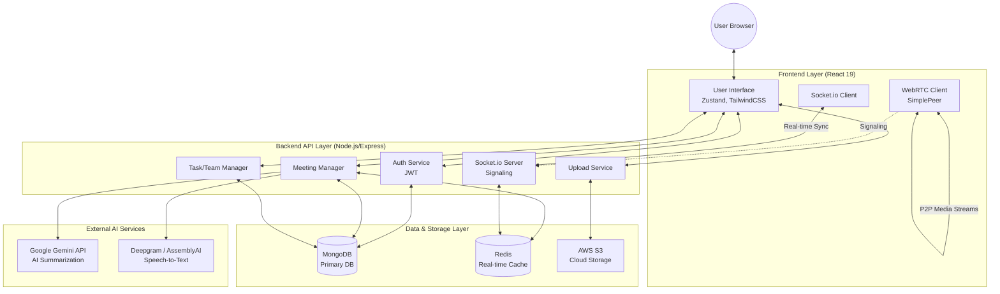

<div align="center">
  
# 🤖 IntellMeet AI

**An AI-Powered Intelligent Meeting Platform & Team Collaboration Workspace**

[](https://react.dev/)
[](https://nodejs.org/)
[](https://www.mongodb.com/)
[](https://redis.io/)
[](https://socket.io/)

IntellMeet is a next-generation video conferencing and collaboration platform designed to make meetings more productive. It integrates real-time video, AI-driven transcripts, interactive Kanban task management, and comprehensive analytics into a single unified workspace.

</div>

---

## ✨ Key Features

### 🎥 Real-Time Video Conferencing
Seamless P2P video and audio communication powered by **WebRTC** and **Socket.io**. Supports screen sharing, camera toggles, and dynamic participant grids.

### 🧠 AI-Powered Insights
IntellMeet uses advanced AI models to auto-generate meeting transcripts, concise summaries, and actionable tasks (Action Items) the moment a meeting ends. 

### 📋 Team Workspaces & Kanban
Manage your projects with built-in Team Workspaces. A real-time, drag-and-drop Kanban board (powered by `@dnd-kit`) synchronizes tasks instantly across all team members using WebSockets.

### 📊 Analytics Dashboard
Track your team's productivity and engagement with interactive graphs (via **Recharts**). Monitor daily meeting frequencies, meeting category distributions, participation rates, and task completion percentages.

### ☁️ Cloud Storage Integration
Secure file sharing within meetings, avatar uploads, and organization logos are seamlessly handled through **AWS S3 Cloud Storage** with expiring pre-signed URLs for privacy.

---

## 🏗️ System Architecture

IntellMeet is built on a modern MERN-stack architecture with real-time components and AI integrations.



---

## 🚀 Getting Started

### Prerequisites
- **Node.js** (v18 or higher)
- **MongoDB** instance
- **Redis** server
- **AWS S3** bucket credentials
- **Gemini API** key

### Installation

1. **Clone the repository:**
   ```bash
   git clone https://github.com/aayushg2006/intellimeet-ai.git
   cd intellimeet-ai
   ```

2. **Install Backend Dependencies:**
   ```bash
   cd backend
   npm install
   ```

3. **Install Frontend Dependencies:**
   ```bash
   cd ../frontend
   npm install
   ```

4. **Environment Variables:**
   Create a `.env` file in the `backend` directory based on the following template:
   ```env
   PORT=5000
   MONGO_URI=your_mongodb_uri
   REDIS_URL=your_redis_url
   JWT_SECRET=your_jwt_secret
   GEMINI_API_KEY=your_gemini_key
   AWS_ACCESS_KEY_ID=your_aws_key
   AWS_SECRET_ACCESS_KEY=your_aws_secret
   AWS_REGION=your_aws_region
   AWS_S3_BUCKET=your_s3_bucket
   ```

### Running the Application

**Start the Backend:**
```bash
cd backend
npm run dev
```

**Start the Frontend:**
```bash
cd frontend
npm run dev
```

The application will be available at `http://localhost:5173`.

---

## 📁 Project Structure

```text
intellimeet-ai/
├── backend/
│   ├── controllers/      # API Request handlers (analytics, tasks, uploads, meetings)
│   ├── middleware/       # JWT Auth, Multer memory storage
│   ├── models/           # Mongoose schemas (User, Meeting, Task, Team)
│   ├── routes/           # Express route definitions
│   ├── services/         # AWS S3, Gemini AI integrations
│   ├── socket/           # Socket.io signaling and workspace rooms
│   └── server.js         # Entry point
│
└── frontend/
    ├── src/
    │   ├── components/   # Reusable UI (KanbanBoard, VideoPlayer, TaskModal)
    │   ├── pages/        # Views (Dashboard, Analytics, TeamWorkspace, VideoRoom)
    │   ├── store/        # Zustand state management
    │   └── App.jsx       # Routing
    ├── package.json
    └── tailwind.config.js
```

---

## 📈 Analytics & Insights

The platform includes a dedicated, responsive analytics dashboard that provides:
- 📊 **Meeting Frequency:** A weekly breakdown of meeting volumes using interactive bar charts.
- 🍩 **Category Distribution:** A visual donut chart of meeting types (Internal, Client, Strategy).
- ⏱️ **Productivity Metrics:** Granular tracking of your Kanban Task Completion Rates.
- 👥 **Engagement Tracking:** Measurements of user participation rates across Team Workspaces.
- 📥 **CSV Exports:** One-click data exports for external reporting.

---

<div align="center">
  <i>Built with ❤️ for modern, hybrid teams.</i>
</div>
