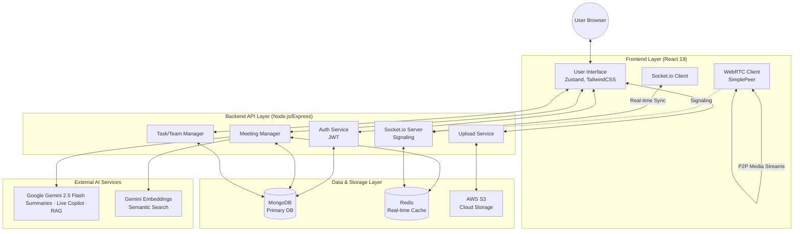

<div align="center">
  
# 🤖 IntellMeet AI

**An AI-Powered Intelligent Meeting Platform & Team Collaboration Workspace**

[](https://react.dev/)
[](https://nodejs.org/)
[](https://www.mongodb.com/)
[](https://redis.io/)
[](https://socket.io/)

IntellMeet is a next-generation video conferencing and collaboration platform designed to make meetings more productive. It integrates real-time video, AI-driven transcripts, interactive Kanban task management, and comprehensive analytics into a single unified workspace.

</div>

---

## ✨ Key Features

### 🎥 Real-Time Video Conferencing
Seamless P2P video and audio communication powered by **WebRTC** and **Socket.io**. Supports screen sharing, camera toggles, and dynamic participant grids.

### 🧠 AI-Powered Insights
IntellMeet uses advanced AI models to auto-generate meeting transcripts, concise summaries, and actionable tasks (Action Items) the moment a meeting ends. 

### 📋 Team Workspaces & Kanban
Manage your projects with built-in Team Workspaces. A real-time, drag-and-drop Kanban board (powered by `@dnd-kit`) synchronizes tasks instantly across all team members using WebSockets.

### 📊 Analytics Dashboard
Track your team's productivity and engagement with interactive graphs (via **Recharts**). Monitor daily meeting frequencies, meeting category distributions, participation rates, and task completion percentages.

### ☁️ Cloud Storage Integration
Secure file sharing within meetings, avatar uploads, and organization logos are seamlessly handled through **AWS S3 Cloud Storage** with expiring pre-signed URLs for privacy.

### 🤖 Live AI Copilot
While a meeting is still running, the server watches the streaming transcript and surfaces **decisions, action items, open questions and risks** as they come up. Analysis runs once per room server-side (not per participant), so every attendee sees the same list and the cost is one LLM call per room — with hard caps on runs per meeting, meeting duration and concurrency.

### 🔎 Search & Ask
Keyword search spans meeting titles, summaries, transcripts and action items. **Ask AI** answers natural-language questions across your meeting history ("what did we decide about pricing?") using retrieval-augmented generation over transcript embeddings, and cites the meetings it drew from.

### 🔔 Notifications
Real-time, persistent notifications for task assignments, meeting invites, `@mentions` in chat, and summary-ready events — delivered over Socket.io to a per-user room and backed by a database so they survive a reload.

---

## 🔐 Security

| Area | Approach |
|---|---|
| **Authentication** | Short-lived access tokens (15 min) paired with **rotating refresh tokens**. Every refresh issues a new token and revokes the old one; presenting an already-used token is treated as a replay and revokes that entire token family. |
| **OAuth** | The Google callback redirects with a **single-use, 60-second exchange code**, not a JWT — so no token lands in browser history or a `Referer` header. |
| **Authorization** | Every meeting, task, summary, message and S3 object is gated on membership. S3 key access is **default-deny**: an unrecognised key prefix is refused rather than falling through. |
| **Injection** | Zod schema validation on request bodies and query strings, plus a sanitizer that strips MongoDB operator keys (`$`, `.`) from all user input. |
| **Transport & headers** | Helmet with a restrictive CSP, `no-referrer`, strict CORS allow-list in production. |
| **Rate limiting** | Global per-IP limit, tighter limits on auth and password reset, and a **per-user** limit on the AI endpoints (the only ones that cost money per request). |
| **Failure handling** | Stack traces and internal error messages are never returned outside development. |

---

## 🏗️ System Architecture

IntellMeet is built on a modern MERN-stack architecture with real-time components and AI integrations.


```mermaid
graph TD
    %% User/Client Tier
    User((User Browser))
    
    subgraph "Frontend Layer (React 19)"
        UI[User Interface <br/> Zustand, TailwindCSS]
        RTC_Client[WebRTC Client <br/> SimplePeer]
        WS_Client[Socket.io Client]
    end
    
    subgraph "Backend API Layer (Node.js/Express)"
        Auth[Auth Service <br/> JWT]
        VideoMgr[Meeting Manager]
        TaskMgr[Task/Team Manager]
        Uploads[Upload Service]
        WS_Server[Socket.io Server <br/> Signaling]
    end
    
    subgraph "Data & Storage Layer"
        DB[(MongoDB <br/> Primary DB)]
        Cache[(Redis <br/> Real-time Cache)]
        S3[AWS S3 <br/> Cloud Storage]
    end
    
    subgraph "External AI Services"
        LLM[Google Gemini 2.5 Flash <br/> Summaries · Live Copilot · RAG]
        Embed[Gemini Embeddings <br/> Semantic Search]
    end

    %% Connections
    User <--> UI
    UI <--> Auth
    UI <--> VideoMgr
    UI <--> TaskMgr
    UI <--> Uploads
    
    RTC_Client -.->|Signaling| WS_Server
    RTC_Client <-->|P2P Media Streams| RTC_Client
    
    WS_Client <-->|Real-time Sync| WS_Server
    
    Auth <--> DB
    VideoMgr <--> DB
    TaskMgr <--> DB
    
    VideoMgr <--> Cache
    WS_Server <--> Cache
    
    Uploads <--> S3
    
    VideoMgr --> LLM
    VideoMgr --> Embed
```

> **Speech-to-text** runs in the browser via the Web Speech API — no external
> transcription service is used. See *Known limitations* below.

---

## 🚀 Getting Started

### Prerequisites
- **Node.js** (v18 or higher)
- **MongoDB** instance
- **Redis** server
- **AWS S3** bucket credentials
- **Gemini API** key

### Installation

1. **Clone the repository:**
   ```bash
   git clone https://github.com/aayushg2006/intellimeet-ai.git
   cd intellimeet-ai
   ```

2. **Install Backend Dependencies:**
   ```bash
   cd backend
   npm install
   ```

3. **Install Frontend Dependencies:**
   ```bash
   cd ../frontend
   npm install
   ```

4. **Environment Variables:**
   Copy `backend/.env.example` to `backend/.env` and fill it in. That file
   documents every variable, which are required, and what degrades if an
   optional one is missing:

   ```bash
   cp backend/.env.example backend/.env
   ```

   **Required:** `MONGODB_URI`, `JWT_SECRET`, `FRONTEND_URL`.
   **Needed for AI features:** `GEMINI_API_KEY`.
   **Needed for uploads/recordings:** the four `AWS_*` variables.

   Everything else is optional and degrades gracefully — the server starts and
   runs without Redis, without TURN, and without an email provider.

### Running the Application

**Start the Backend:**
```bash
cd backend
npm run dev
```

**Start the Frontend:**
```bash
cd frontend
npm run dev
```

The application will be available at `http://localhost:5173`.

---

## 📁 Project Structure

```text
intellimeet-ai/
├── backend/
│   ├── controllers/      # API Request handlers (analytics, tasks, uploads, meetings)
│   ├── middleware/       # JWT Auth, Multer memory storage
│   ├── models/           # Mongoose schemas (User, Meeting, Task, Team)
│   ├── routes/           # Express route definitions
│   ├── services/         # AWS S3, Gemini AI integrations
│   ├── socket/           # Socket.io signaling and workspace rooms
│   └── server.js         # Entry point
│
└── frontend/
    ├── src/
    │   ├── components/   # Reusable UI (KanbanBoard, VideoPlayer, TaskModal)
    │   ├── pages/        # Views (Dashboard, Analytics, TeamWorkspace, VideoRoom)
    │   ├── store/        # Zustand state management
    │   └── App.jsx       # Routing
    ├── package.json
    └── tailwind.config.js
```

---

## 📈 Analytics & Insights

The platform includes a dedicated, responsive analytics dashboard that provides:
- 📊 **Meeting Frequency:** A weekly breakdown of meeting volumes using interactive bar charts.
- 🍩 **Category Distribution:** A visual donut chart of meeting types (Internal, Client, Strategy).
- ⏱️ **Productivity Metrics:** Granular tracking of your Kanban Task Completion Rates.
- 👥 **Engagement Tracking:** Measurements of user participation rates across Team Workspaces.
- 📥 **CSV Exports:** One-click data exports for external reporting.

---

## ⚖️ Engineering Trade-offs & Known Limitations

Stated plainly rather than glossed over — these are deliberate decisions with reasons, not oversights.

### WebRTC uses a mesh topology, not an SFU
Every participant holds a peer connection to every other participant, so connection count grows as **O(n²)** and each client uploads its stream once per peer. In practice this is comfortable up to **4–6 participants** and degrades beyond that.

A Selective Forwarding Unit (mediasoup, LiveKit) would make each client upload once regardless of room size, which is how production platforms scale to 50+. That was out of scope here: it requires a separate media server with its own deployment, scaling and cost model. Mesh is the correct choice for the traffic this application actually serves, and the migration path is well understood.

### Transcription is browser-based and Chrome/Edge only
Speech-to-text uses the **Web Speech API**, which runs in the browser at no cost but is unsupported in Firefox and Safari, and is currently hardcoded to `en-US`. The app detects this and shows a banner rather than failing silently. A server-side provider (Whisper, Deepgram) would be cross-browser and multilingual at a per-minute cost.

### TURN is required for reliable connectivity
Public STUN servers can discover a peer's public address but cannot relay media. Two peers behind symmetric NAT — most corporate networks and many mobile carriers — cannot connect without a TURN relay. TURN credentials are configurable via environment variables; without them the app still works on permissive networks but may fail on restrictive ones, and the UI now says so instead of showing a black tile.

### Search is capped at 2,000 meetings per user
The permission-scoped meeting set is bounded so a single query can't scan an unbounded collection. Beyond that ceiling, only the most recent meetings are searchable.

### Semantic search degrades by design
Atlas Vector Search is used when the cluster provides it. On a free-tier cluster that has no vector index, the app detects this by probing once and falls back to scoring cosine similarity in Node over a keyword-narrowed candidate set — slower, but functional rather than broken.

### No TypeScript
The frontend is plain JSX. Converting ~8,700 lines mid-project would have consumed most of the available effort, carried real regression risk against a working deployment, and fixed zero actual defects. That effort went into eliminating authorization bugs and adding features instead. ESLint is clean; API contracts are validated at the boundary with Zod on the server.

---

<div align="center">
  <i>Built with ❤️ for modern, hybrid teams.</i>
</div>
